# Slides: Chapter 4 Personality and Values | Book Chapter 5

> Book: Robbins & Judge, Organizational Behavior 13th Edition

### 1. What is Personality?
The sum total of ways in which an individual reacts and interacts with others, the measurable traits a person exhibits

#### Measuring Personality
- Helpful in hiring decisions
- Most common method: self-reporting surveys
- Observer-ratings surveys  provide an independent assessment of personality – often better predictors

### Personality Determinants

#### Heredity
- Factors determined at conception: physical stature, facial attractiveness, gender, temperament, muscle composition and reflexes, energy level, and bio-rhythms
- This “Heredity Approach” argues that genes are the source of personality
- Twin studies: raised apart but very similar personalities
- Parents don’t add much to personality development
- There is some personality change over long time periods

### Personality Traits
Long-term characteristics that describe an individual’s behavior

- The more consistent the characteristic and the more frequently it occurs in diverse situations, the more important the trait.
- Two dominant frameworks used to describe personality:
    - Myers-Briggs Type Indicator (MBTI®)
    - Big Five Model

### The Myers-Briggs Type Indicator

Most widely used instrument in the world.
Participants are classified on four axes to determine one of 16 possible personality types, such as ENTJ. 

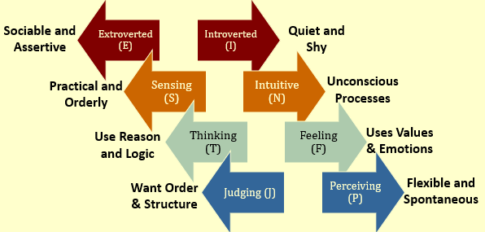

Each of the sixteen possible combinations has a name, for instance: 
    - Visionaries (INTJ) – original, stubborn, and driven.
    - Organizers (ESTJ) – realistic, logical, analytical, and businesslike.
    - Conceptualizer (ENTP) – entrepreneurial, innovative, individualistic, and resourceful.

Research results on validity mixed.
    - MBTI® is a good tool for self-awareness and counseling.
    - Should not be used as a selection test for job candidates.

### The Big Five Model of Personality Dimensions | (EA-CEO)/ OCEAN

5. Openness to Experience: Curious, imaginative, artistic, and sensitive
3. Conscientiousness: Responsible, dependable, persistent, and organized
1. Extroversion: Sociable, gregarious, and assertive
2. Agreeableness: cooperative, Good-natured,  and trusting
4. Emotional Stability/Neuroticism (Stress handling): Calm, self-confident, secure under stress (positive), versus nervous, depressed, and insecure under stress (negative)

## How Do the Big Five Traits Predict Behavior?

- Research has shown this to be a better framework.
- Certain traits have been shown to strongly relate to higher job performance:
    - Highly conscientious people develop more job knowledge, exert greater effort, and have better performance.
    - Other Big Five Traits also have implications for work.
        - Emotional stability is related to  job satisfaction.
        - Extroverts tend to be happier in their jobs and have good social skills.
        - Open people are more creative and can be good leaders.
        - Agreeable people are good in social settings.

### Other Personality Traits Relevant to OB

1. Core Self-Evaluation
    - The degree to which people like or dislike themselves
    - Positive self-evaluation leads to higher job performance

2. Machiavellianism
    - A pragmatic, emotionally distant power-player who believes that ends justify the means.
    - High Machs are manipulative, win more often, and persuade more than they are persuaded. Flourish when:
        - Have direct interaction
        - Work with minimal rules and regulations
        - Emotions distract others

3. Narcissism
    - An arrogant, entitled, self-important person who needs excessive admiration.
    - Less effective in their jobs.

<!-- #### More Relevant Personality Traits  -->

4. Self-Monitoring
    - The ability to adjust behavior to meet external, situational factors.
    - High monitors conform more and are more likely to become leaders.

5. Risk Taking
    - The willingness to take chances.
    - May be best to align propensities with job requirements.
    - Risk takers make faster decisions with less information.

<!-- #### Even More Relevant Personality Traits  -->

6. Type A Personality
    - Aggressively involved in a chronic, incessant struggle to achieve more in less time
        - Impatient: always moving, walking, and eating rapidly
        - Strive to think or do two or more things at once
        - Cannot cope with leisure time
        - Obsessed with achievement numbers 
    - Prized in North America but quality of the work is low
    - Type B people are the complete opposite

7. Proactive Personality
    - Identifies opportunities, shows initiative, takes action, and perseveres to completion
    - Creates positive change in the environment 

## Values

Basic convictions on how to conduct yourself or how to live your life that is personally or socially preferable – “How To” live life properly.

- Attributes of Values:
    - Content Attribute – that the mode of conduct or end-state is important
    - Intensity Attribute – just how important that content is.

- Value System
    - A person’s values rank ordered by intensity
    - Tends to be relatively constant and consistent

### Importance of Values
- Provide understanding of the attitudes, motivation, and behaviors
- Influence our perception of the world around us
- Represent interpretations of “right” and “wrong”
- Imply that some behaviors or outcomes are preferred over others

### Classifying Values – Rokeach Value Survey

- Terminal Values
    - Desirable end-states of existence; the goals that a person would like  to achieve during his or her lifetime

- Instrumental Values
    - Preferable modes of behavior or means of achieving one’s terminal values

- People in same occupations or categories tend to hold similar values
    - But values vary between groups
    - Value differences make it difficult for groups to negotiate and may create conflict

### Value Differences Between Groups
- Executives, Union Membes, Activists

### Generational Values

| Cohort | Entered Workforce | Approximate Current Age | Dominant Work Values | 
|--------|-------------------|-------------------------|----------------------|
|Veterans| 1950-1964         | 65+                     | Hardworking, Conservative, loyalty to organization|
|Boomers | 1965-1985         | 40-60s                  | Success, Achievment, ambition, loyalty to career |
| Xers   | 1985-2000         | 20-40s                  | Work/life balance, team-oriented, loyalty to relationships|
| Nexters| 2000-Present      | Under 30                | Confident, financial success, loyalty to both self and relationships|

### Linking Personality and Values to the Workplace

Managers are less interested in someone’s ability to do a specific job than in that person’s flexibility.

1. Person-Job Fit:
    - John Holland’s Personality-Job Fit Theory
        - Six personality types
        - Vocational Preference Inventory (VPI)
    - Key Points of the Model:
        - There appear to be intrinsic differences in personality between people
        - There are different types of jobs
        - People in jobs congruent with their personality should be more satisfied and have lower turnover

## Holland’s Personality Typology & Occupations

| Type                                                                                 | Congruent Occupation |
|--------------------------------------------------------------------------------------|----------------------|
|Realistic: prefer phyical activities that require skill, strength                     | Mechanic, farmer, etc|
|Investigative: prefer activites that require thinking, organizin, and understanding   | Biologist, economist, mathematician, news reporter|
|Social: prefer activites that involve helping and devloping others                    | Social worker, teacher, counselor, psychologist|
|Conventional: prefer unambiguos activites, orderly, and rule-regulated                | Accountant, bank teller, file clerk|
|Enterprising: prefer verbal activities in which there are opportunties to influence others | lawyer, politician?|
|Artistic: prefer ambiguous and unsystematic activities that allow creative expression | Painter, musician, coder 🥹|

### Relationships Among Personality Types

### Still Linking Personality to the Workplace

In addition to matching the individual’s personality to the job, managers are also concerned with:

2. Person-Organization Fit:
    - The employee’s personality must fit with the organizational culture.
    - People are attracted to organizations that match their values.
    - Those who match are most likely to be selected.
    - Mismatches will result in turnover.
    - Can use the Big Five personality types to match to the organizational culture.

## Global Implications

- Personality
    - Do frameworks like Big Five transfer across cultures?
        - Yes, but the frequency of type in the culture may vary.
        - Better in individualistic than collectivist cultures.

- Values
    - Values differ across cultures.
    - Hofstede’s Framework for assessing culture – five value dimensions:
        - Power Distance
        - Individualism vs. Collectivism
        - Masculinity vs. Femininity
        - Uncertainty Avoidance
        - Long-term vs. Short-term Orientation

### Hofstede’s Framework: Power Distance
The extent to which a society accepts that power in institutions and organizations is distributed unequally.

1. Low distance
    - Relatively equal power between those with status/wealth and those without status/wealth

2. High distance
    - Extremely unequal power distribution between those with status/wealth and those without status/wealth

### Hofstede’s Framework: Individualism

3. Individualism
    - The degree to which people prefer to act as individuals rather than a member of groups

4. Collectivism
    - A tight social framework in which people expect others in groups of which they are a part to look after them and protect them

### Hofstede’s Framework: Masculinity

5. Masculinity
    - The extent to which the society values work roles of achievement, power, and control, and where assertiveness and materialism are also valued

6. Femininity
    - The extent to which there is little differentiation between roles for men and women 

### Hofstede’s Framework: Uncertainty Avoidance
The extent to which a society feels threatened by uncertain and ambiguous situations and tries to avoid them

1. High Uncertainty Avoidance:  
    - Society does not like ambiguous situations and tries to avoid them. 

2. Low Uncertainty Avoidance:  
    - Society does not mind ambiguous situations and embraces them.  

### Hofstede’s Framework: Time Orientation

1. Long-term Orientation
    - A national culture attribute that emphasizes the future, thrift, and persistence
2. Short-term Orientation
    - A national culture attribute that emphasizes the present and the here and now 

### Hofstede’s Framework: An Assessment

1. There are regional differences within countries
2. The original data is old and based on only one company
3. Hofstede had to make many judgment calls while doing the research
4. Some results don’t match what is believed to be true about given countries
5. Despite these problems it remains a very popular framework

### GLOBE Framework for Assessing Cultures

- Global Leadership and Organizational Behavior Effectiveness (GLOBE) research program.
    - Nine dimensions of national culture

- Similar to Hofstede’s framework with these additional dimensions:
    - Humane Orientation: how much society rewards people for being altruistic, generous, and kind.
    - Performance Orientation: how much society encourages and rewards performance improvement and excellence.

### Summary and Managerial Implications

- Personality
    - Screen for the Big Five trait of conscientiousness 
    - Take into account the situational factors as well
    - MBTI® can help with training and development

- Values
    - Often explain attitudes, behaviors, and perceptions
    - Higher performance and satisfaction achieved when the individual’s values match those of the organization.

------------------------------------------------------------------------

# Slides Chapter 8: Emotion and Moods | Book Chapter 4

### Why Were Emotions Ignored in OB?

- The “Myth of Rationality”
    - Emotions were seen as irrational
    - Managers worked to make emotion-free environments

- View of Emotionality
    - Emotions were believed to be disruptive
    - Emotions interfered with productivity
    - Only negative emotions were observed

> Now we know emotions can’t be separated from the workplace

### What are Emotions and Moods?

- Affect: A broad range of emotions that people experience
    - Emotions
        - Intense feelings that are directed at someone or something
    - Moods
        - Feelings that tend to be less intense than emotions and that lack a contextual stimulus

### The Basic Emotions | SSDHAF

While not universally accepted, there appear to be six basic emotions:

1. Anger
2. Fear
3. Sadness
4. Happiness
5. Disgust
6. Surprise

> All other emotions are subsumed under these six
> May even be placed in a spectrum of emotion: Happiness – surprise – fear – sadness – anger - disgust

### Basic Moods: Positive and Negative Affect

- Emotions cannot be neutral.
- Emotions (“markers”) are grouped into general mood states.
- Mood states affect perception and therefore perceived reality.

### What Is the Function of Emotion?

- Do Emotions Make Us Irrational?
    - Expressing emotions publicly may be damaging to social status
    - Emotions are critical to rational decision-making
    - Emotions help us understand the world around us

- What Functions Do Emotions Serve?
    - Darwin argued they help in survival problem-solving
    - Evolutionary psychology: people must experience emotions as there is a purpose behind them
    - Not all researchers agree with this assessment

### Sources of Emotion and Mood

- Personality: There is a trait component – affect intensity
- Day and Time of the Week: There is a common pattern for all of us
    - Happier in the midpoint of the daily awake period 
    - Happier toward the end of the week
- Weather: Illusory correlation – no effect 
- Stress: Even low levels of constant stress can worsen moods
- Social Activities: Physical, informal, and dining activities increase positive moods

### More Sources of Emotion and Mood

- Sleep: Poor sleep quality increases negative affect
- Exercise: Does somewhat improve mood, especially for depressed people
- Age: Older folks experience fewer negative emotions
- Gender: 
    - Women tend to be more emotionally expressive, feel emotions more intensely, have longer-lasting moods, and express emotions more frequently than do men
    - Due more to socialization than to biology 

### Emotional Labor
An employee’s expression of organizationally desired emotions during interpersonal transactions at work.

- Emotional Dissonance:
    - Employees have to project one emotion while simultaneously feeling another
    - Can be very damaging and lead to burnout

- Types of Emotions:
    - Felt: the individual’s actual emotions
    - Displayed: required or appropriate emotions
        - Surface Acting: displaying appropriately but not feeling those emotions internally 
        - Deep Acting: changing internal feelings to match display rules  - very stressful

### Affective Events Theory (AET)

An event in the work environment triggers positive or negative emotional reactions
    - Personality and mood determine response intensity 
    - Emotions can influence a broad range of work variables

### Implications of AET 

1. An emotional episode is actually the result of a series of emotional experiences triggered by a single event
2. Current and past emotions affect job satisfaction
3. Emotional fluctuations over time create variations in job performance
4. Emotion-driven behaviors are typically brief and variable 
5. Both negative and positive emotions can distract workers and reduce job performance

> Emotions provide valuable insights about behavior
> Emotions, and the minor events that cause them, should not be ignored at work: they accumulate

### Emotional Intelligence (EI)

- A person’s ability to:
    - Be self-aware
        - Recognizing own emotions when experienced
    - Detect emotions in others
    - Manage emotional cues and information
- EI plays an important role in job performance
- EI is controversial and not wholly accepted
    - Case for EI:
        - Intuitive appeal; predicts criteria that matter; is biologically-based.
    - Case against EI:
        - Too vague a concept; can’t be measured; its validity is suspect.

### OB Applications of Emotions and Moods

- Selection: EI should be a hiring factor, especially for social jobs.  
- Decision Making: Positive emotions can lead to better decisions.
- Creativity: Positive mood increases flexibility, openness, and creativity.
- Motivation: Positive mood affects expectations of success; feedback amplifies this effect.
- Leadership: Emotions are important to acceptance of messages from organizational leaders.
- Negotiation: Emotions, skillfully displayed, can affect negotiations
- Customer Services: 
    - Emotions affect service quality delivered to customers which, in turn, affects customer relationships
    - Emotional Contagion: “catching” emotions from others
- Job Attitudes: Can carry over to home, but dissipate overnight
- Deviant Workplace Behaviors: Negative emotions lead to employee deviance  (actions that violate norms and threaten the organization)
- Manager’s Influence: Leaders who are in a good mood, use humor, and praise employees increase positive moods in the workplace.

### Global Implications

- Do people experience emotions equally?
    - No.  Culture can determine type, frequency, and depth of experienced emotions

- Do people interpret emotions the same way?
    - Yes.  Negative emotions are seen as undesirable and positive emotions are desirable
    - However, value of each emotion varies across cultures

- Do norms of emotional expression vary?
    - Yes.  Some cultures have a bias against emotional expression; others demand some display of emotion
    - How the emotions are expressed may make interpretation outside of one’s culture difficult 

### Summary and Managerial Implications

- Moods are more general than emotions and less contextual
- Emotions and moods impact all areas of OB
- Managers cannot and should not attempt to completely control the emotions of their employees
- Managers must not ignore the emotions of their co-workers and employees
- Behavior predictions will be less accurate if emotions are not taken into account

--------------------------------------------------------------------------------------------------

# Slides Chapter 5: Perception and Individual Decision Making | Book Chapter 6

### What is Perception?
- A process by which individuals organize and interpret their sensory impressions in order to give meaning to their environment.
- People’s behavior is based on their perception of what reality is, not on reality itself.
- The world as it is perceived is the world that is behaviorally important.

### Factors that Influence Perception

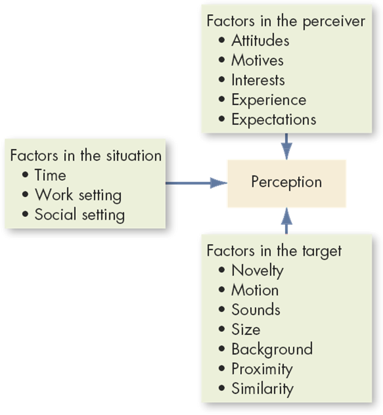

### Attribution Theory: Judging Others

- Our perception and judgment of others is significantly influenced by our assumptions of the other person’s internal state.
    - When individuals observe behavior, they attempt to determine whether it is internally or externally caused.
        - Internal causes are under that person’s control
        - External causes are not – person forced to act in that way

- Causation judged through:
    - Distinctiveness
        - Shows different behaviors in different situations.
    - Consensus
        - Response is the same as others to same situation.
    - Consistency
        - Responds in the same way over time.

### Elements of Attribution Theory

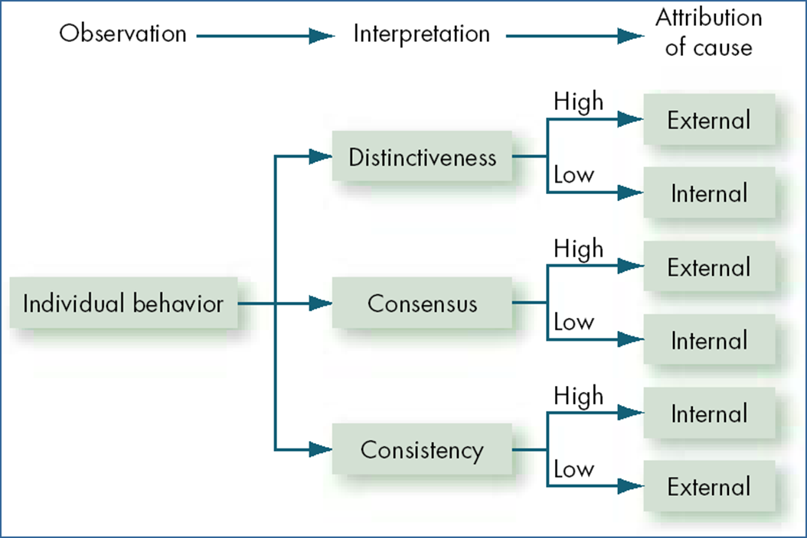

### Errors and Biases in Attributions

- Fundamental Attribution Error
    - The tendency to underestimate the influence of external factors and overestimate the influence of internal factors when making judgments about the behavior of others
    - We blame people first, not the situation

- Self-Serving Bias
    - The tendency for individuals to attribute their own successes to internal factors while putting the blame for failures on external factors
    - It is “our” success but “their” failure

### Frequently Used Shortcuts in Judging Others

1. Selective Perception
    - People selectively interpret what they see on the basis of their interests, background, experience, and attitudes

2. Halo Effect
    - Drawing a general impression about an individual on the basis of a single characteristic

3. Contrast Effects
    - Evaluation of a person’s characteristics that are affected by comparisons with other people recently encountered who rank higher or lower on the same characteristics

4. Stereotyping

Judging someone on the basis of one’s perception of the group to which that person belongs – a prevalent and often useful, if not always accurate, generalization

    - Profiling
        - A form of stereotyping in which members of a group are singled out for intense scrutiny based on a single, often racial, trait.

### Specific Shortcut Applications in Organizations

1. Employment Interview
    - Perceptual biases of raters affect the accuracy of interviewers’ judgments of applicants
    - Formed in a single glance – 1/10 of a second!

2. Performance Expectations
    - Self-fulfilling prophecy (Pygmalion effect): The lower  or higher performance of employees reflects preconceived leader expectations about employee capabilities
3. Performance Evaluations
    - Appraisals are often the subjective (judgmental) perceptions of appraisers of another employee’s job performance 
    - Critical impact on employees

### Perceptions and Individual Decision Making

1. Problem
    - A perceived discrepancy between the current state of affairs and a desired state

2. Decisions
    - Choices made from among alternatives developed from data

3. Perception Linkage:
    - All elements of problem identification and the decision making process are influenced by perception.
        - Problems must be recognized
        - Data must be selected and evaluated

### Decision-Making Models in Organizations

1. Rational Decision-Making
    - The “perfect world” model: assumes complete information, all options known, and maximum payoff.
    - Six step decision-making process

2. Bounded Reality
    - The “real world” model: seeks satisfactory and sufficient solutions from limited data and alternatives

3. Intuition
    - A non-conscious process created from distilled experience that results in quick decisions
        - Relies on holistic associations
        - Affectively charged – engaging the emotions

### Common Biases and Errors in Decision-Making

1. Overconfidence Bias
    - Believing too much in our own ability to make good decisions – especially when outside of own expertise

2. Anchoring Bias
    - Using early, first received information as the basis for making subsequent judgments

3. Confirmation Bias
    - Selecting and using only facts that support our decision

4. Availability Bias
    - Emphasizing information that is most readily at hand
        - Recent  
        - Vivid

### More Common Decision-Making Errors

- Escalation of Commitment
    - Increasing commitment to a decision in spite of  evidence that it is wrong – especially if responsible for the decision!

- Randomness Error
    - Creating meaning out of random events - superstitions
- Winner’s Curse
    - Highest bidder pays too much due to value overestimation
    - Likelihood increases with the number of people in auction
- Hindsight Bias
    - After an outcome is already known, believing it could have been accurately predicted  beforehand

### Individual Differences in Decision-Making

- Personality
    - Conscientiousness may effect escalation of commitment
        - Achievement-strivers are likely to increase commitment
        - Dutiful people  are less like to have this bias
    - Self-Esteem
        - High self-esteem people are susceptible to self-serving bias

- Gender
    - Women analyze decisions more than men – rumination
    - Women are twice as likely to develop depression
    - Differences develop early

### Organizational Constraints

- Performance Evaluation
    - Managerial evaluation criteria influence actions
- Reward Systems
    - Managers will make the decision with  the greatest personal payoff for them
- Formal Regulations
    - Limit the alternative choices of decision makers
- System-imposed Time Constraints
    - Restrict ability to gather or evaluate information 
- Historical Precedents
    - Past decisions influence current decisions

### Ethics in Decision Making

Ethical Decision Criteria
    - Utilitarianism
        - Decisions made based solely on the outcome
        - Seeking the greatest good for the greatest number
        - Dominant method for businesspeople
    - Rights
        - Decisions consistent with fundamental liberties and privileges
        - Respecting and protecting basic rights of individuals such as whistleblowers
    - Justice
        - Imposing and enforcing rules fairly and impartially
        - Equitable distribution of benefits and costs

### Ethical Decision-Making Criteria Assessed

- Utilitarianism
    - Pro: Promotes efficiency and productivity
    - Con: Can ignore individual rights, especially minorities

- Rights
    - Pro: Protects individuals from harm; preserves rights
    - Con: Creates an overly legalistic work environment

- Justice
    - Pro: Protects the interests of weaker members
    - Con: Encourages a sense of entitlement 

### Improving Creativity in Decision Making

- Creativity
    - The ability to produce novel and useful ideas

- Who has the greatest creative potential?
    - Those who score high in Openness to Experience
    - People who are intelligent, independent, self-confident, risk-taking, have an internal locus-of-control, tolerant of ambiguity,  low need for structure, and who persevere in the face of frustration

### The Three Component Model of Creativity
Proposition that individual creativity results from a mixture of three components

- Expertise is the foundation
- Creative-Thinking Skills are the personality characteristics associated with creativity
- Intrinsic Task Motivation is the desire to do the job because of its characteristics

### Global Implications

1. Attributions
    - There are cultural differences in the ways people attribute cause to observed behavior

2. Decision-Making
    - No research on the topic: assumption of “no difference”
    - Based on our awareness of cultural differences in traits that affect decision making, this assumption is suspect

3. Ethics
    - No global ethical standards exist
    - Asian countries tend not to see ethical issues in “black and white” but as shades of gray
    - Global companies need global standards for managers

### Summary and Managerial Implications

- Perception:
    - People act based on how they view their world
    - What exists is not as important as what is believed
    - Managers must also manage perception

- Individual Decision Making
    - Most use bounded rationality: they satisfice
    - Combine traditional methods with intuition and creativity for better decisions
        - Analyze the situation and adjust to culture and organizational reward criteria
        - Be aware of, and minimize, biases
----------------------------------------------------------------------------------------------------------------------

# Slides Chapter 7: Motivational Concepts | Book Chapter 7 

### Defining Motivation
The result of the interaction between the individual and the situation.

- The processes that account for an individual’s intensity, direction, and persistence of effort toward attaining a goal – specifically, an organizational goal.

- Three key elements:
    - Intensity – how hard a person tries
    - Direction – effort that is channeled toward, and consistent with, organizational goals
    - Persistence – how long a person can maintain effort

## Early Theories of Motivation
These early theories may not be valid, but they do form the basis for contemporary theories and are still used by practicing managers.

1. Maslow’s Hierarchy of Needs Theory  
    - Alderfer’s ERG (Existence, Relatedness, and Growth)
2. McGregor’s Theory X and Theory Y
3. Herzberg’s Two-Factor  Theory
4. McClelland’s Theory of Needs

### 1. Maslow’s Hierarchy of Needs
There is a hierarchy of five needs. As each need is substantially satisfied, the next need becomes dominant.

Assumptions
Individuals cannot move to the next higher level until all needs at the current (lower) level are satisfied 
Must move in hierarchical order

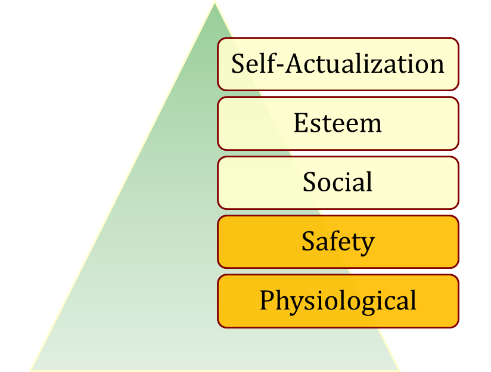

### Alderfer’s ERG Theory

A reworking of Maslow to fit empirical research.

- Three groups of core needs:
    - Existence (Maslow: physiological and safety)
    - Relatedness (Maslow: social and status)
    - Growth (Maslow: esteem and self-actualization)
- Removed the hierarchical assumption
    - Can be motivated by all three at once
- Popular, but not accurate, theory

### 2. McGregor’s Theory X and Theory Y

Two distinct views of human beings: Theory X (basically negative) and Theory Y (positive).
- Managers used a set of assumptions based on their view
- The assumptions molded their behavior toward employees
- No empirical evidence to support this theory.

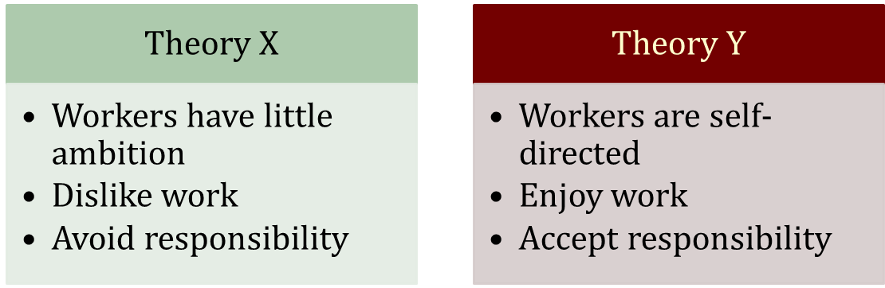

### 3. Herzberg’s Two-Factor Theory
- A theory that relates intrinsic factors to job satisfaction and associates extrinsic factors with dissatisfaction.
- Also called motivation-hygiene theory.

- Key Point: Satisfaction and dissatisfaction are not opposites but separate constructs
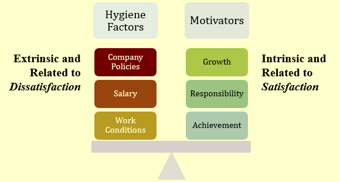

### Criticisms of Two-Factor Theory

Herzberg says that hygiene factors must be met to remove dissatisfaction. If motivators are given, then satisfaction can occur.

- Herzberg is limited by his procedure 
    - Participants had self-serving bias
- Reliability of raters questioned 
    - Bias or errors of observation
- No overall measure of satisfaction was used
- Herzberg assumed, but didn’t research, a strong relationship between satisfaction and productivity

### McClelland’s Three Needs Theory

A theory that states achievement, power, and affiliation are three important needs that help explain motivation.

- Need for Achievement (nAch)
    - The drive to excel, to achieve in relation to a set of standards, to strive to succeed
- Need for Power (nPow)
    - The need to make others behave in a way that they would not have behaved otherwise
- Need for Affiliation (nAff)
    - The desire for friendly and close interpersonal relationships
- People have varying levels of each of the three needs.
    - Hard to measure

### Performance Predictions for High nAch
- People with a high need for achievement are likely to:
    - Prefer to undertake activities with a 50/50 chance of success,  avoiding very low- or high-risk situations
    - Be motivated in jobs that offer high degree of personal responsibility, feedback, and moderate risk
    - Not necessarily make good managers – too personal a focus. Most good general managers do NOT have a high nAch
    - Need high level of nPow and low nAff for managerial success

- Good research support, but it is not a very practical theory

### Contemporary Theories of Motivation

1. Self-determination theory
2. Cognitive Evaluation Theory
3. Goal-Setting Theory
    - Management by Objectives (MBO)
4. Self-Efficacy Theory
    - Also known as Social Cognitive Theory or Social Learning Theory
5. Reinforcement Theory
6. Equity Theory
7. Expectancy Theory

### 1. Self-determination theory
A theory of motivation that is concerned with the beneficial effects of intrinsic motivation and the harmful effects of extrinsic motivation.

“It’s strange,” said Marcia. “I started work at the Humane Society as a volunteer. I put in 15 hours a week helping people adopt pets. And I loved coming to work. Then, 3 months ago, they hired me full-time at $11 an hour. I’m doing the same work I did before. But I’m not finding it as much fun.”

### 2. Cognitive Evaluation Theory

Providing an extrinsic reward for behavior that had been previously only intrinsically rewarding tends to decrease the overall level of motivation

- Major Implications for work rewards
    - Intrinsic and extrinsic rewards are not independent
    - Extrinsic rewards decrease intrinsic rewards
    - Pay should be noncontingent on performance
    - Verbal rewards increase intrinsic motivation; tangible rewards reduce it

- Self-concordance 
    - When the personal reasons for pursuing goals are consistent with personal interests and core values (intrinsic  motivation), people are happier and more successful

### 3. Locke’s Goal-Setting Theory

- Basic Premise: 
    - That specific and difficult goals, with self-generated feedback, lead to higher performance

- Difficult Goals:
    - Focus and direct attention
    - Energize the person to work harder
    - Difficulty increases persistence
    - Force people to be more effective and efficient

- Three personal factors influence the goals–performance relationship: goal commitment, task characteristics, and national culture.
- Relationship between goals and performance depends on: 
    - Goal commitment (the more public the better!)
    - Task characteristics (simple, well-learned)
    - Culture (best match is in North America)

1. Goal Commitment
    - Goal-setting theory assumes an individual is committed to the goal and determined not to lower or abandon it. The individual (1) believes he or she can achieve the goal and (2) wants to achieve it.

2. Task Characteristics
    - Goals themselves seem to affect performance more strongly when tasks are simple rather than complex, well learned rather than novel, independent rather than interdependent, and on the high end of achievable.

3. National Culture
    - Setting specific, difficult, individual goals may have different effects in different cultures. In collectivistic and high-power-distance cultures, achievable moderate goals can be more motivating than difficult ones.

- Promotion focus
    - A self-regulation strategy that involves striving for goals through advancement and accomplishment.
- Prevention focus 
    - A self-regulation strategy that involves striving for goals by fulfilling duties and obligations.

### Implementation: Management by Objectives

Management by objectives (MBO) A program that encompasses specific goals, participatively set, for an explicit time period, with feedback on goal progress.

- MBO is a systematic way to utilize goal-setting. 
- Goals must be:
    - Tangible
    - Verifiable
    - Measurable

- Corporate goals are broken down into smaller, more specific goals at each level of organization.
- Four common ingredients to MBO programs:
    - Goal specificity
    - Participative decision making
    - Explicit time period
    - Performance feedback

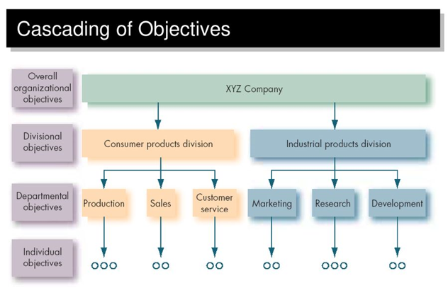

### 4. Bandura’s Self-Efficacy Theory

### Increasing Self-Efficacy

### 5. Reinforcement Theory

### Operant Conditioning/behaviorism and reinforcement

### Social-learning theory and reinforcement

### Attentional processes.

### 6. Equity theory/organizational Justice

### Equity Theory’s “Relevant Others”

### Reactions to Inequity

###  Justice and Equity Theory

### 7. Vroom’s Expectancy Theory

### Job Engagement

### Integrating Contemporary Theories of Motivation

### Global Implications

- Motivation theories are often culture-bound.
    - Maslow’s Hierarchy of Needs Theory
        - Order of needs is not universal
    - McClelland’s Three Needs Theory
        - nAch presupposes a willingness to accept risk and performance concerns – not universal traits
    - Adams’ Equity Theory
        - A desire for equity is not universal
        - “Each according to his need” – socialist/former communists
- Desire for interesting work seems to be universal.
    - There is some evidence that the intrinsic factors of Herzberg’s Two-Factor Theory may be universal

### Summary and Managerial Implications
- Need Theories (Maslow, Alderfer, McClelland, Herzberg)
    - Well known, but not very good predictors of behavior
- Goal-Setting Theory
    - While limited in scope, good predictor
- Reinforcement Theory
    - Powerful predictor in many work areas
- Equity Theory
    - Best known for research in organizational justice
- Expectancy Theory
    - Good predictor of performance variables but shares many of the assumptions as rational decision making

# Motivation Concepts to Applications

### Motivation by Job Design: The JCM

- Job Characteristics Model (JCM)
    - Hackman and Oldham’s concept that any job can be described through five core job dimensions:
        - Skill variety – Requirements for different tasks in the job.
        - Task identity – Completion of a whole piece of work.
        - Task significance – The job’s impact on others.
        - Autonomy – Level of discretion in decision making. 
        - Feedback – Amount of direct and clear information on performance.
    - The way elements in a job are organized (job design) impacts motivation, satisfaction, and performance.

### The Job Characteristics Model

### Motivating Potential Score (MPS)
Five dimensions combined into a single predictive index of motivation.

- People who work on jobs with high core dimensions are generally more motivated, satisfied, and productive.
- Job dimensions operate through the psychological states in influencing personal and work outcome variables rather than influencing them directly.

While the JCM framework is supported by research, the MPS model isn’t practical and doesn’t work well.

### How Can Jobs Be Redesigned?

- Job Rotation
    - The periodic shifting of a worker from one task to another

- Job Enlargement
    - The horizontal expansion of jobs

- Job Enrichment
    - The vertical expansion of jobs

### Guidelines for Enriching a Job

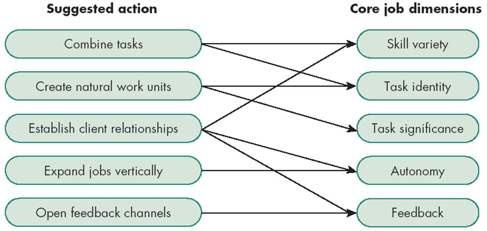

### Alternative Work Arrangements

- Flextime
    - Employees work during a common core time period each day but have discretion in forming their total workday from a flexible set of hours outside the core.
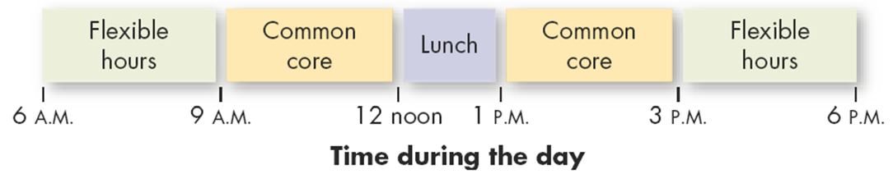

- Job Sharing
    - The practice of having two or more people split a 40-hour-a-week job

### Another Alternative: Telecommuting

- Telecommuting
    - Employees do their work at home at least two days a week on a computer that is linked to their office.
- The Virtual Office
    - Employees work out of their home on a relatively permanent basis.
- Typical Telecommuting Jobs
    - Professional and other knowledge-related tasks
    - Routine information-handling tasks
    - Mobile activities

### Reasons for and against Telecommuting 

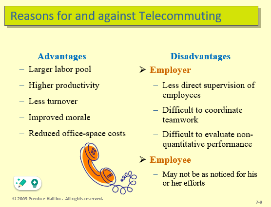

### Employee Involvement

A participative process that uses the input of employees to increase their commitment to the organization’s success.

- By increasing worker autonomy and control over work lives (involvement), organizations:
    - Increase employee motivation
    - Gain greater organizational commitment
    - Experience greater worker productivity
    - Observe higher levels of job satisfaction

### Types of Employee Involvement Programs

- Participative Management
    - Subordinates share a significant degree of decision-making power with their immediate superiors

- Representative Participation
    - Works councils
        - Groups of nominated or elected employees who must be consulted for any personnel decisions
    - Board representative
        - An employee sits on a company’s board of directors and represents the interests of the firm’s employees
- Quality Circle
    - A work group of employees who meet regularly to discuss their quality problems, investigate causes, recommend solutions, and take corrective actions

### Four Major Strategic Reward Decisions 

1. What to pay? (pay structure)
2. How to pay individuals? (variable pay plans and skill-based pay plans)
3. What benefits to offer? Do we offer choice of benefits? (flexible benefits)
4. How to build recognition programs?

### 1. What to Pay – Pay Structure

- Internal equity
    - The worth of the job to the organization
    - Determined by job evaluations

- External equity
    - The competitiveness of the company’s pay relative to pay elsewhere in the industry
    - Determined through pay surveys

- Choose organizational position
    - Pay leaders 
        - Greater employee loyalty
        - Attracts better-quality employees
    - Pay laggards – accept high turnover for low hourly costs

### 2. How to Pay  - Variable Pay Programs

Types of Variable Pay Programs

A portion of an employee’s pay is based on some individual and/or organizational measure of performance

- Piece Rate:
    - Workers are paid a fixed sum for each unit of production completed
    - Weakness: not feasible for many jobs

- Merit-Based: 
    - Based on performance appraisal ratings
    - Gap increasing between average and top-performers
    - Weaknesses: validity of system based on annual appraisals, pay pool can be small, unions strongly resist
- Bonuses:
    - Rewards recent performance
    - Weakness: employees consider this a pay

Types of Skill-Based Programs:

Also known as competency- or knowledge-based pay  - sets pay based on skills or number of jobs an employee can perform

- Profit Sharing:
    - Organization-wide programs that distribute compensation based on some established formula designed around a company’s profitability
- Gain Sharing:
    - An incentive plan in which improvements in group productivity determine the total amount of money that is allocated

- Employee Stock Ownership Plans (ESOPs)
    - Company-established benefit plans in which employees acquire stock as part of their benefits

### Evaluation of Variable and Skill-based Pay 

To some extent, variable pay does increase motivation and productivity

- Benefits of Skill-based Pay Plans
    - Provide staffing flexibility
    - Facilitate communication across the organization
    - Lessen “protection of territory” behaviors
    - Meet the needs of employees for advancement
    - Lead to performance improvements

- Drawbacks:
    - Lack of additional learning opportunities
    - Continuing to pay employees for obsolete skills
    - Paying for skills of no immediate use to the organization
    - Paying for a skill, not for performance of the skill

### 3. What Benefits to Offer - Flexible Benefits

Employees tailor their benefit program to meet their personal need by picking and choosing from a menu of benefit options.

- Modular Plans 
    - Predesigned benefits packages for specific groups of employees

- Core-Plus Plans
    - A core of essential benefits and a menu-like selection of other benefit options

- Flexible Spending Plans 
    - Allow employees to use their tax-free benefit dollars to purchase benefits and pay service premiums

### 4. How to Build Recognition Programs

- Intrinsic Rewards: Stimulate Intrinsic Motivation 
    - Personal attention given to employee
    - Approval and appreciation for a job well done
    - Growing in popularity and usage

- Benefits of Programs
    - Fulfill employees’ desire for recognition
    - Inexpensive to implement 
    - Encourage repetition of desired behaviors

- Drawbacks of Programs
    - Susceptible to manipulation by management 

###  Global Implications

- Job Characteristics and Job Enrichment
    - Inconsistent results across cultures
- Telecommuting
    - U.S. does this more, but EU workers are interested in it
- Variable Pay
    - Not much research available, but some possible hypotheses on relationships
- Flexible Benefits
    - This concept is becoming more prevalent globally
- Employee Benefits
    - Practices must be modified to match culture

### Summary and Managerial Implications

To Motivate Employees
    - Recognize individual differences
    - Use goals and feedback
    - Allow employees to participate in decisions that affect them
    - Link rewards to performance
    - Check the reward system for equity

# Chapter 19: Organizational Change and Stress Management

### Forces for Change

- Nature of the Workforce
    - Greater diversity
- Technology
    - Faster, cheaper, more mobile
- Economic Shocks
    - Mortgage meltdown
- Competition
    - Global marketplace
- Social Trends
    - Baby boom retirements
- World Politics
    - Iraq War and the opening of China

### Planned Change

- Change
    - Making things different
- Planned Change
    - Activities that are proactive and purposeful: an intentional, goal-oriented activity
    - Goals of planned change
        - Improving the ability of the organization to adapt to changes in its environment
        - Changing employee behavior
- Change Agents
    - Persons who act as catalysts and assume the responsibility for managing change activities

### Resistance to Change

Resistance to change appears to be a natural and positive state

- Forms of Resistance to Change:
    - Overt and Immediate
        - Voicing complaints, engaging in job actions
- Implicit and Deferred
    - Loss of employee loyalty and motivation, increased errors or mistakes, increased absenteeism
    - Deferred resistance clouds the link between source and reaction

### Sources of Resistance to Change

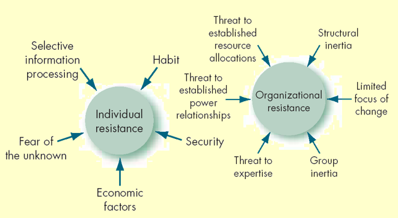

### Tactics for Overcoming Resistance to Change

- Education and Communication
    - Show those effected the logic behind the change
- Participation
    - Participation in the decision process lessens resistance
- Building Support and Commitment
    - Counseling, therapy, or new-skills training
- Implementing Change Fairly
    - Be consistent and procedurally fair
- Manipulation and Cooptation
    - “Spinning” the message to gain cooperation
- Selecting people who accept change
    - Hire people who enjoy change in the first place
- Coercion
    - Direct threats and force

### The Politics of Change

- Impetus for change is likely to come from outside change agents, new employees, or managers outside the main power structure.
- Internal change agents are most threatened by their loss of status in the organization.
- Long-time power holders tend to implement incremental but not radical change.
- The outcomes of power struggles in the organization will determine the speed and quality of change.

### Lewin’s Three-Step Change Model

- Unfreezing
    - Change efforts to overcome the pressures of both individual resistance and group conformity
- Refreezing
    - Stabilizing a change intervention by balancing driving and restraining forces

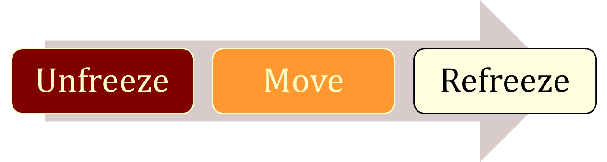

### Lewin: Unfreezing the Status Quo

- Driving Forces
    - Forces that direct behavior away from the status quo
- Restraining Forces
    - Forces that hinder movement from the existing equilibrium

### Kotter’s Eight-Step Plan

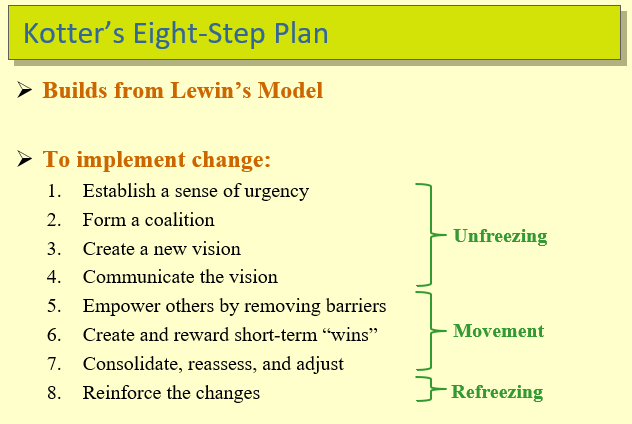

------------------------------------------------------

### Action Research

A change process based on systematic collection of data and then selection of a change action based on what the analyzed data indicates

- Process steps:

1. Diagnosis
2. Analysis
3. Feedback
4. Action
5. Evaluation

- Action research benefits:
    - Problem-focused rather than solution-centered
    - Heavy employee involvement reduces resistance to change

### Organizational Development

- Organizational Development (OD)
    - A collection of planned interventions, built on humanistic-democratic values, that seeks to improve organizational effectiveness and employee well-being
- OD Values
    - Respect for people
    - Trust and support
    - Power equalization
    - Confrontation
    - Participation

### Six OD Techniques

1. Sensitivity Training
    - Training groups (T-groups) that seek to change behavior through unstructured group interaction
    - Provides increased awareness of others and self
    - Increases empathy with others, listening skills, openness, and  tolerance for others

2. Survey Feedback Approach
    - The use of questionnaires to identify discrepancies among member perceptions; discussion follows and remedies are suggested

3. Process Consultation (PC)
    - A consultant gives a client insights into what is going on around the client, within the client, and between the client and other people; identifies processes that need improvement.

4. Team Building
    - High interaction among team members to increase trust and openness
5. Intergroup Development
    - OD efforts to change the attitudes, stereotypes, and perceptions that groups have of each other
6. Appreciative Inquiry
    - Seeks to identify the unique qualities and special strengths of an organization, which can then be built on to improve performance
        - Discovery: Recalling the strengths of the organization
        - Dreaming: Speculation on the future of the organization
        - Design: Finding a common vision
        - Destiny: Deciding how to fulfill the dream

### Creating a Culture for Change: Innovation

1. Stimulating a Culture of Innovation
    - Innovation: a new idea applied to initiating or improving a product, process, or service

    - Sources of Innovation:
        - Structural variables: organic structures
        - Long-tenured management
        - Slack resources
        - Interunit communication

    - Idea Champions: Individuals who actively promote the innovation

2. Learning Organization
    - An organization that has developed the continuous capacity to adapt and change
    - Learning Types
        - Single-Loop: errors are corrected using past routines
        - Double-Loop: errors are corrected by modifying routines
    - Characteristics 
        - Holds a shared vision
        - Discards old ways of thinking
        - Views organization as system of relationships
        - Communicates openly
        - Works together to achieve shared vision

### Creating a Learning Organization

- Overcomes traditional organization problems:
    - Fragmentation
    - Competition
    - Reactiveness

- Manage Learning by:
    - Establishing a strategy
    - Redesigning the organization’s structure
        - Flatten structure and increase cross-functional activities
    - Reshaping the organization’s culture
        - Reward risk-taking and intelligent mistakes

### Work Stress

- Stress
    - A dynamic condition in which an individual is confronted with an opportunity, constraint, or demand related to what he or she desires and for which the outcome is perceived to be both uncertain and important

- Types of Stress
    - Challenge Stressors
        - Stress associated with workload, pressure to complete tasks, and time urgency
    - Hindrance Stressors
        - Stress that keeps you from reaching your goals, such as red tape
        - Cause greater harm than challenge stressors

### Demands-Resources Model of Stress

- Demands
    - Responsibilities, pressures, obligations, and uncertainties in the workplace
- Resources
    - Things within an individual’s control that can be used to resolve demands

> Adequate resources help reduce the stressful nature of demands

### A Model of Stress

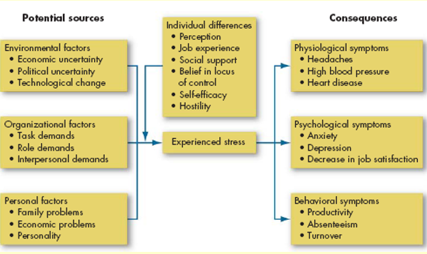

### Potential Sources of Stress 

- Environmental Factors
    - Economic uncertainties of the business cycle
    - Political uncertainties of political systems
    - Technological uncertainties of technical innovations
- Organizational Factors
    - Task demands related to the job
    - Role demands of functioning in an organization
    - Interpersonal demands created by other employees
- Personal Factors
    - Family and personal relationships
    - Economic problems from exceeding earning capacity
    - Personality problems arising from basic disposition

### Consequences of Stress

Stressors are additive: high levels of stress can lead to the following symptoms

- Physiological
    - Blood pressure, headaches, stroke

- Psychological 
    - Dissatisfaction, tension, anxiety, irritability, boredom, and procrastination
    - Greatest when roles are unclear in the presence of conflicting demands
- Behavioral
    - Changes in job behaviors, increased smoking or drinking, different eating habits, rapid speech, fidgeting, sleep disorders

### Not All Stress Is Bad

- Some level of stress can increase productivity
- Too little or too much stress will reduce performance
- This model is not empirically supported

### Managing Stress

- Individual Approaches
    - Implementing time management
    - Increasing physical exercise
    - Relaxation training
    - Expanding social support network

- Organizational Approaches
    - Improved personnel selection and job placement
    - Training
    - Use of realistic goal setting
    - Redesigning of jobs
    - Increased employee involvement
    - Improved organizational communication
    - Offering employee sabbaticals
    - Establishment of corporate wellness programs

###     Global Implications

- Organizational Change
    - Culture varies people’s belief in the possibility of change
    - Time orientation will affect implementation of change
    - Reliance on tradition can increase resistance to change
    - Power distance can modify implementation methods
    - Idea champions act differently in different cultures

- Stress
    - Job conditions that cause stress vary across cultures
    - Stress itself is bad for everyone
    - Having friends and family can reduce stress

### Summary and Managerial Implications
- Organizations and the individuals within them must undergo dynamic change
- Managers are change agents and modifiers of organizational culture
- Stress can be good or bad for employees
- Despite possible improvements in job performance caused by stress, such improvements come at the cost of increased job dissatisfaction